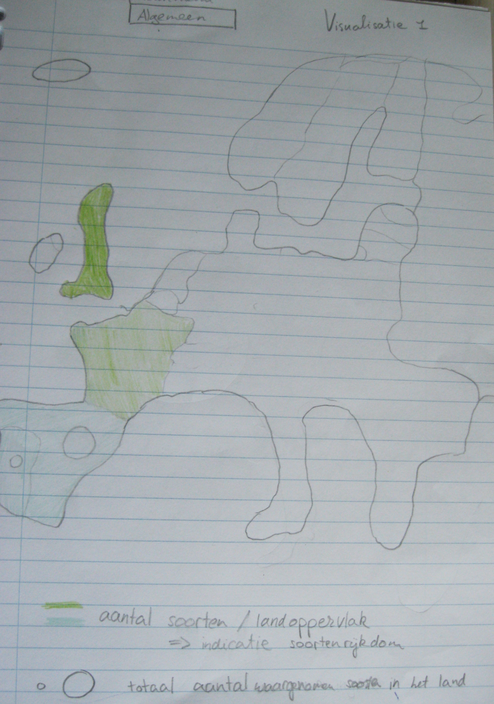
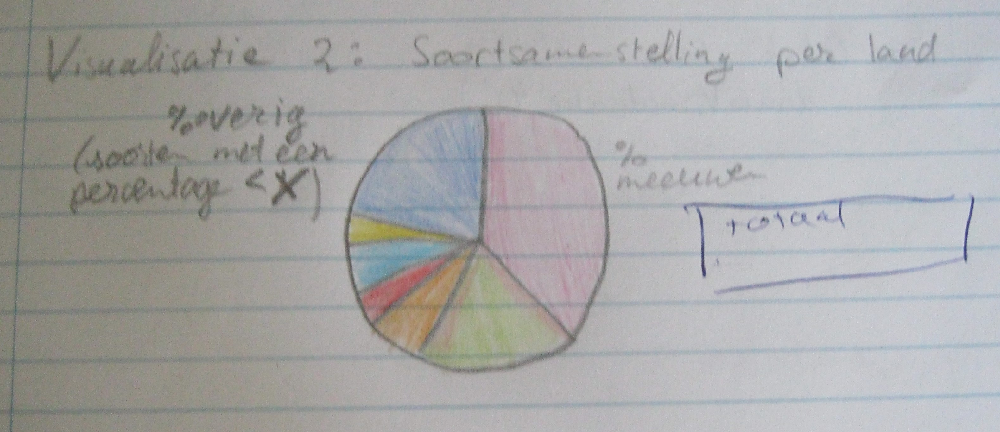
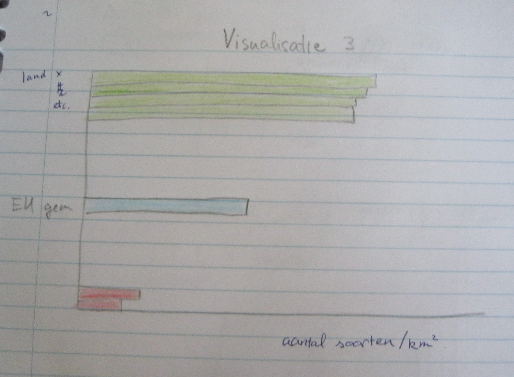
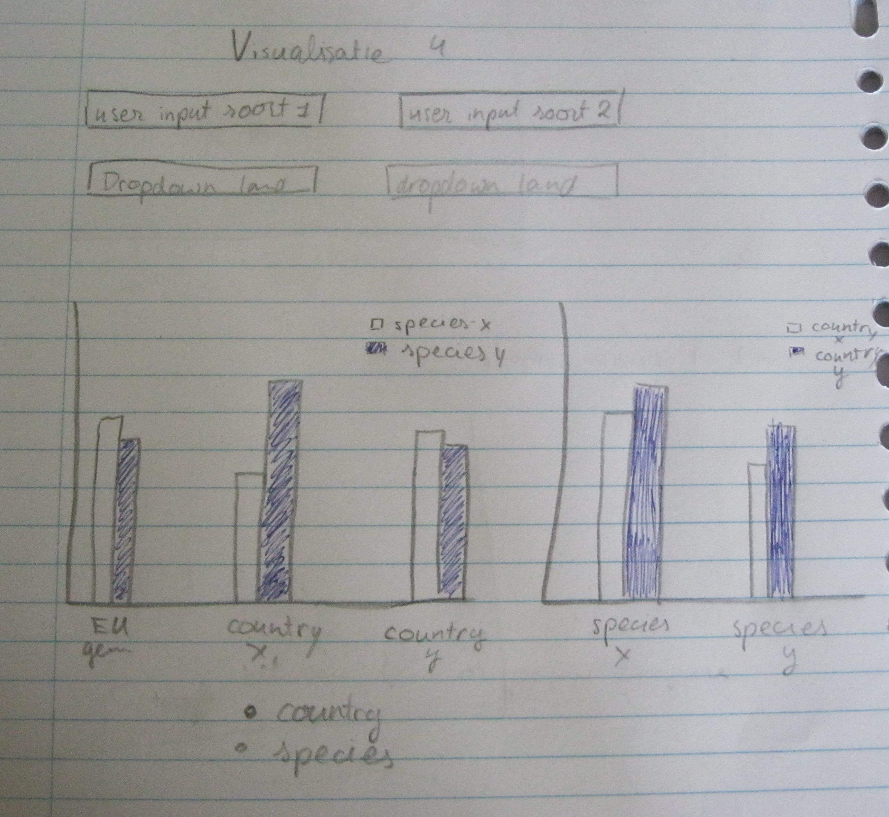

## Design Project

Het doel van de visualisatie is om te laten zien welke Europese landen het goed doen qua broedvogelsoort rijkdom. Er zijn 4 verschillende visualisaties. De visualisaties 1 en
3 zijn beide gelinked aan visualisatie 2. Visualisatie 4 staat veel interactie met de gebruiker toe.

#####Visualisatie 1: Europese kaart broedvogels
Het doel van deze visualisatie is om een overzicht te geven van de situatie in Europa. De standaardinstelling is alle soorten. De gebruiker kan vervolgens
via een dropdownmenu een soort selecteren, waarna de kaart alleen nog maar de gegevens van die soort laat zien. 
Totale aantal vogels (of soorten) per land (gemiddeld per jaar. Data voor 23 jaar). Schalen van bubbels (misschien bubbel te groot voor land)? Kleur van bubbels (dan niet landen ook nog eens verschillende kleuren invullen, te verwarrend)?
Benodigde data landkleur: totaal aantal soorten per land en de totale landoppervlakte

.JPG)

#####Visualisatie 2: Piechart soortsamenstelling land
Met deze visualisatie kan de gebruiker makkelijk voor een land zien wat de soortsamenstelling voor dat land is. Een land wordt geselecteerd door ofwel op een land
in Visualisatie 1 te klikken, of op een land (een kolom) in Visualisatie 3. 
Benodigde data: Alle waarnemingen voor het geselecteerde land (= 100%), per soort een percentage

#####Visualisatie 3: Barchart (bars horizontaal) biodiversiteit (staat eigenlijk al in de landkaart)
Deze visualisatie laat nog een keer de biodiversiteit van Europa zien net zoals Visualisatie 1. De toegevoegde waarde van deze visualisatie is de mogelijkheid om 
landen echt goed te vergelijken doordat de landen van hoogste broedvogelbiodiversiteit per landoppervlakte, naar laagste zijn afgebeeld in een gekantelde barchart. 
Benodigde data: totaal aantal soorten per land en de totale landoppervlakte
Bar met europees gemiddelde in het midden in een andere kleur (erboven landen die het beter doen (in groen), eronder landen die het slechter doen (in rood)).
Interactie: in plaats van biodiversiteit per land, kan er ook een soort geselecteerd worden waardoor snel duidelijk wordt wat de beste landen zijn per soort.

#####Visualisatie 4: Barchart (bars verticaal) Gebruiker kan landen vergelijken voor 1 of meerdere soorten. 
In deze visualisatie kan de gebruiker zelf de data onderzoeken, door zowel de landen als de soorten te selecteren waarin hij/zij geïnteresseerd is. Door op de knop onderin ofwel country, 
of species aan te klikken past de x-as zich aan waardoor het makkelijker wordt om resp. soorten per land of landen per soort te vergelijken (zie linker barchart en rechter barchart).
Benodigde data: voor land x, y, z, het totale aantal waarnemingen voor de geselecteerde soort. Het europees gemiddelde voor die soort. 

####Technische Implementatie
De [Dataset waarnemingen](http://ipt.sovon.nl/resource?r=eoa1997): 
- heel erg groot 
- waarnemingen zijn met coordinaten ingevuld. Dat is heel erg leuk, maar visualisaties 2, 3 en 4 worden moeilijker als de data niet op land is. 
	Als de dataset klein was geweest, was het ook mogelijk om dat on the fly in te vullen, maar nu is het waarschijnlijk sneller om het van te voren in python aan te passen. 
	Het nadeel is wel dat visualisatie 1 dan echt per land is, en niet per gebied. Het was leuk geweest om bijvoorbeeld ook natuurgebieden te kunnen herkennen doordat daar de broedvogeldichtheid
	groter is. 
	Het voordeel is dat visualisaties 2, 3 en 4 makkelijker te implementeren worden, en dat de dataset kleiner wordt.
- aanpassen m.b.v. python: 
	alleen kolommen soortnaam en coordinaten behouden
	coordinaten omzetten naar landnaam (lukt nog niet)

De dataset zal in zijn geheel geladen worden, samen met [de dataset van de landoppervlakte](https://en.wikipedia.org/wiki/List_of_European_countries_by_area). Dit wordt gedaan met behulp van een queue. 
De Visualisaties worden in hetzelfde script geschreven, om de interacties tussen visualisaties te vergemakkelijken. 