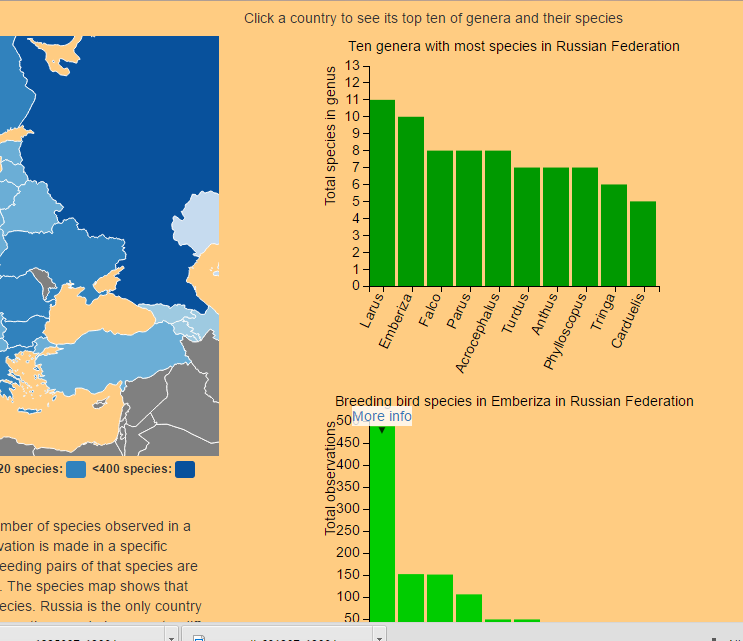

## Breeding Birds in Europe

##### Annabel Droste

Met deze visualisatie wordt inzichtelijk gemaakt welke vogels in Europa broeden, in welk land ze broeden, wat de top tien van genera zijn die in een land broeden. 
Een genus is een geslacht, dus vogelsoorten die aan elkaar verwant zijn. Bijvoorbeeld het geslacht Larus, dat zijn de meeuwensoorten. 
De [dataset](http://ipt.sovon.nl/resource?r=eoa1997) bevat data die is verzameld tussen 1972-1975. 

Er zijn 3 verschillende visualisaties. De eerste visualisatie is een kaart van Europa waarop het aantal broedende vogelsoorten of het aantal observaties per land kan worden gevisualiseerd.
Als er op een land wordt geklikt verschijnt er een barchart die de top tien van genera laat zien waarvan de meeste vogelsoorten in dat land broeden. Als er vervolgens
op een genusbar wordt geklikt komt er een barchart onder te staan waarin te zien is welke soorten dat zijn en hoe vaak ze zijn geobserveerd. 

In de 3e visualisatie, die bestaat uit een kaart en een barchart, kan de gebruiker met behulp van een dropdownmenu een soort selecteren. Op de kaart wordt vervolgens
aangegeven in welke landen hij broedt en waar niet, in de barchart is het aantal observaties te zien. 

Het aantal observaties per soort is niet goed te vergelijken tussen landen doordat het totale aantal observaties per land sterk verschilt (zie visualisatie 1). 

#### Licences
De code (countries.py in de map scripts) om de coordinaten uit de dataset om te zetten naar landnamen komt van https://github.com/che0/countries .
Het shapefile dat in die code wordt gebruikt, TM_WORLD_BORDERS-0.3, is verkregen van de site http://thematicmapping.org/ .
De code om alle drieletter landcodes te krijgen die datamaps gebruikt komt van stackoverflow: http://stackoverflow.com/questions/25044145/datamaps-get-list-of-country-codes 
De dataset komt van E J M Hagemeijer and M J Blair (Editors). 1997. The EBCC Atlas of European Breeding Birds: Their Distribution and Abundance. T & A D Poyser, London.