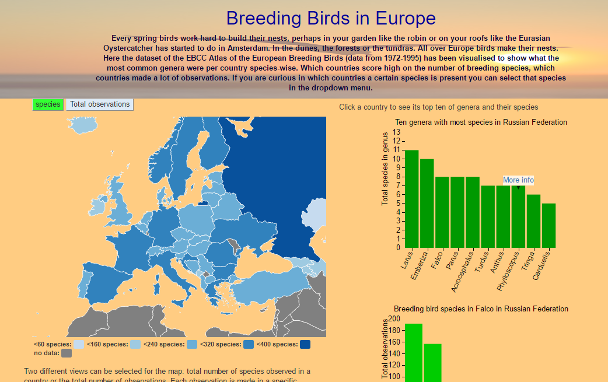

## Breeding Birds in Europe
----------------------------------------------

#### Annabel Droste
----------------------------------------------

## Beschrijving van de visualisaties
Deze visualisatie laat de gebruiker onderzoeken waar bepaalde soorten broeden, welke genera (geslachten) het meest in een land broeden (bijv. de meeuwen), welk land de 
meeste broedvogelsoorten telt en waar de meeste observaties zijn gedaan. Als de gebruiker bijvoorbeeld wil weten in welke landen de ijsvogel broedt, dan
kan die soort via het dropdown menu geselecteerd worden waarna de kaart wordt gekleurd om te laten zien in welke landen broedparen aanwezig zijn en welke niet. 
Op de eerste kaart kan ofwel het aantal soorten per land, of het aantal observaties per land worden geselecteerd. Als er op een land wordt geklikt worden de 
10 genera waarvan de meeste soorten in het land broeden in een barchart gevisualiseerd. Dit laat zien dat er in Nederland bijvoorbeeld meer mezensoorten broeden dan meeuwensoorten. Dit geeft
een indicatie wat voor soort vogels veel aanwezig zijn in een land. Als er vervolgens op een van de bars wordt geklikt wordt er een tweede barchart getekend waar te zien is welke mezen of meeuwensoorten dat dan zijn. Beide barcharts
hebben een hoverfunctie die een link laat zien naar de desbetreffende wikipediapagina van de soort of genus, op die manier kunnen gebruikers meer informatie opzoeken over een soort of genus. 
De dataset die gebruikt is, is de research dataset van E J M Hagemeijer and M J Blair (Editors). 1997. The EBCC Atlas of European Breeding Birds: Their Distribution and Abundance. T & A D Poyser, London. 
De data is vergaard tussen 1972 en 1995. 

Dit staat eronder:

## Visueel design

#### Het geheel
De header bevat een plaatje van een vliegende meeuw omdat het er leuk en levendig uitziet. Om de overgang van de introductie naar de rest zo vloeiend mogelijk te laten gaan
is voor de achtergrondkleur van de rest ook voor een soort oranjeachtige kleur gekozen. Het is prettiger om naar te kijken dan fel wit en zorgt ervoor dat de eerste kaart duidelijk zichtbaar is, ook met heel lichtblauw.
De pagina is ruwweg in twee kolommen omdat visualisatie 1 en 2 naast elkaar moeten staan aangezien de gebruiker anders niet doorheeft dat er iets gebeurt als hij op 
een land klikt. Bootstrap is gebruikt omdat dat het true-live-search van het dropdown menu makkelijker maakt en omdat de positionering van de elementen wordt makkelijker.

#### Visualisatie 1: kaart aantal soorten en observaties
Voor beide visualisaties is voor een blauw kleurenschema gekozen (verkregen van colorbrewer2.org). Het is een single hue, blauw schema. Er is voor blauw gekozen aangezien blauw een neutrale, niet-aggressieve kleur is
en prettig om naar te kijken. Als er overheen gehoverd wordt, is er voor groen gekozen zodat het goed duidelijk wordt bij welk land de tooltip hoort. In de tooltip
staan zowel het aantal observaties als het aantal soorten in een land, zodat het mogelijk is om snel landen te vergelijken. Rusland heeft bijvoorbeeld meer soorten dan Oekraïne. Maar dat hangt af van het aantal observaties in het land.
Door ook meteen naar het aantal observaties te kunnen kijken in de tooltip, blijkt dat Rusland ook daar veel meer van heeft. Daardoor kan men aannemen dat Rusland over het algemeen meer soorten broedvogels heeft dan Oekraïne. 
De twee buttons bovenaan de kaart worden gebruikt om tussen de kaarten te schakelen. De kaart die op dat moment gevisualiseerd wordt, heeft een groene button, net zoals de hoverfunctie
zodat het nog duidelijker wordt dat geselecteerde elementen groen zijn. Als er op een land geknipt wordt, wordt de top 10 genera laten zien (zie visualisatie 2).

#### Visualisatie 2: top 10 genera en diens soorten
De top 10 genera heeft ook groen als kleur om de link met de kaart duidelijk te maken (hoverfunctie en ingeklikte button) maar tegelijkertijd te laten zien dat
niet hetzelfde wordt gevisualiseerd als in de kaart (dus niet aantal soorten of aantal observaties per land). De link van de hoverfunctie heeft een witte achtergrond met opacity
om ervoor te zorgen dat de link goed leesbaar blijft als hij bijvoorbeeld door de as gaat. De bars worden lichter als er overheen gehoverd wordt om duidelijk te maken welke geselecteerd is. 

#### Visualisatie 3: Verspreiding van 1 soort
Er is gekozen voor een dropdown menu omdat de gebruiker op die manier niet de precieze spelling van de naam in de database hoeft in te typen. Er staat een button naast
zodat duidelijk is wat er gaat gebeuren en wat de bedoeling is van de visualisatie. In de kaart is een roodachtige/oranjekleur gekozen om aanwezigheid 
te laten zien. Er is voor deze kleur gekozen omdat groen en blauw al andere variabelen laten zien in de andere visualisaties en roodachtig wel duidelijk af te lezen is. 
Het is niet twee keer dezelfde kleur als de barchart omdat beide een andere variabele laten zien: in de kaart presentie, in de barchart aantal observaties. De barchart is groen, aangezien het dezelfde
variabele is als de bars van visualisatie 2. De kleur donkerblauw is gekozen voor absent in de kaart aangezien het goed contrasteert met het roodachtige. Het is wel een andere kleur blauw dan in de eerste kaart
omdat het wel een andere betekenis heeft. Grijs geeft geen data aan, net zoals in de eerste kaart. 
Alle barcharts hebben een schuin ticklabel op de x-as aangezien ik dat altijd een stuk leesbaarder vindt dan een volledig verticale. 

## Technisch design
De basis van de visualisaties staat in birds_europe.js, de functies voor de barcharts staan in barcharts.js en de kaarten worden gekleurd door mapfunctions.js. 

#### Visualisatie 1 en 2: kaart aantal soorten/observaties en top 10 genera en diens soorten
De eerste kaart wordt meteen aangemaakt door window.onload functie. Hij staat standaard op species (aantal soorten per land). Nadat de kaart is aangemaakt wordt de button gekleurd. Als er op een
andere button wordt gedrukt, worden beide buttons meegegeven aan een functie die de kleur verandert, wordt de kaart gekleurd en de legenda verandert met behulp van jquery. 
Het was tamelijk lastig (vond ik) om de legenda van de datamap te veranderen zonder zelf helemaal een legenda te definiëren. Ik heb de datamap functie map.legend() gebruikt om
een legenda te tekenen. Hierdoor komen in de legenda altijd de fillKeys te staan. Doordat zowel soorten als observaties dezelfde datamap gebruiken maar wel een andere schaal hebben, creëerde dat problemen. 
Uiteindelijk was de oplossing redelijk simpel door de td elementen van de datamap te selecteren met jQuery en diens tekst met replaceWith te veranderen afhankelijk van de geklikte button. 

Als er op een land geklikt wordt, wordt een functie aangeroepen om een barchart te maken. Deze functie krijgt als argumenten de landnamen en de observaties die in dat land zijn gedaan, mee.
Als de data nog een keer wordt verwerkt zodat het in het goede format staat om er makkelijk een barchart van de maken wordt de d.details ook meegegeven, zodat de soorten binnen dat genus
makkelijk toegankelijk zijn voor de barchart van de soorten in een genus. Ik heb ervoor gekozen om beide barcharts met dezelfde functie te tekenen aangezien er redelijk veel 
overlap in code was. Om ervoor te zorgen dat wel de juiste data werd geselecteerd en de juiste labels op de assen kwamen, worden er aan het begin van de functie variabelen aangemaakt
die een andere waarde hebben naargelang de message ("species" of "genus") die wordt meegegeven aan de functie. De message geeft aan of er respectievelijk een genus barchart of een species barchart moet worden gemaakt.
Doordat de hoeveelheid bars per chart kan verschillen wordt de barhartbreedte dynamische bepaald. Als er slechts 1 soort binnen een genus is, ziet dat er minder mooi uit, maar in de andere gevallen is het beter dan
de breedte van de chart aan te passen met het risico dat het plotseling onder de map komt te staan i.p.v. in zijn eigen kolom.

#### Visualisatie 3: Verspreiding van 1 soort
Met behulp van een dropdownmenu kan de gebruiker een soort selecteren. Als vervolgens op de knop ernaast wordt gedrukt wordt de barchart getekend en de kaart ingekleurd. 
Ik heb voor een extra knop gekozen omdat het dan voor de gebruiker duidelijk is waar hij/zij op moet klikken. Het dropdownmenu wordt gemaakt met behulp van een lijst met alle soorten die
in de dataset voorkomen (499). Deze lijst wordt eenmaal in de window.onload-functie aangemaakt. De data-live-search van bootstrap is op "true" gezet zodat er suggesties komen te staan 
als de gebruiker typt. Dit zorgt ervoor dat de gebruiker niet de alle 499 soorten langs hoeft te gaan. 
Er is voor een dropdownmenu gekozen omdat de gebruiker nu niet de precieze naam hoeft in te typen die ook in de dataset voorkomt. Ook worden nonsens inputs niet geaccepteerd. 
Als er op de button naast het dropdownmenu wordt geklikt, wordt met behulp van jQuery de soortnaam gepakt. Deze naam wordt meegegeven aan de functie diversity() die de barchart
maakt en de functie colorSpeciesMap aanroept die de kaart kleurt. Deze functie wordt binnen de barchartfunctie aangeroepen omdat er dan slechts 1 keer door de dataset geloopt hoeft te worden om 
de landennamen te krijgen waar de soort aanwezig is. 

#### Dataverwerking
De dataset die gebruikt is, is 500 MB groot. Om ervoor te zorgen dat kladblok niet telkens vastloopt als ik de opbouw van de dataset bekijk, heb ik de dataset in tweeën gesplitst.
De "'s" is vervangen door een "s" om te voorkomen dat python telkens foutmeldingen gaf bij het jsondumpen. Het grootste probleem met de dataset was het omzetten van 
coördinaten naar landnamen. Het is te doen met een google API, die is redelijk snel i.v.m. andere methodes. Het nadeel is dat er maar 2500 queries per dag waren toegestaan, 
en met een dataset van meer dan 300.000 waarnemingen was dat niet te doen. 
Ik heb het daarom met behulp van een python programma gedaan, maar helaas is het een hele langzame methode. Het zoekt de coordinaten op in een shapefile en checkt vervolgens in
welk land het ligt. OSgeoW is nodig voor de modulen osgeo en gdal. De code komt van https://github.com/che0/countries . En het shapefile van http://thematicmapping.org/ .
Zowel de google API als het python programma herkennen geen coördinaten die in zee liggen. Ik heb geaccepteerd dat die niet worden meegenomen in de visualisaties. 
De dataset was ook niet helemaal duidelijk wat betreft het aantal vogels per observaties. In de dataset was er een kolom met individualCount die aangaf hoeveel vogels van een soort
op dat coördinaat gespot waren. De waarden van deze kolom waren als volgt: 0, 0-9, 100-999, 1000-9999, 10000-99999 en "no estimation". Deze getallen zijn nauwelijks te vergelijken en
omdat "no estimation" nog minder zegt over het aantal broedende vogels heb ik ervoor gekozen om elke rij in de dataset als 1 observatie te tellen.  

De scripts voor de dataverwerking staan in de map scriptspython. Het zijn allemaal verschillende scripts omdat het dan makkelijker om tussen door te checken of er iets fout gaat. 
Dat is handig omdat de stap van coördinaten naar landnamen zo traag is en dan is het niet prettig om na een paar uur erachter te komen dat je een verkeerd bestand of iets dergelijks als 
input hebt gegeven. 

## Veranderingen van het oorspronkelijke DESIGN.md
In het DESIGN.md was ik ervan uitgegaan dat er data (datums) waren ingevoerd bij de observaties maar dat bleek niet het geval. Daardoor zijn de visualisaties meer geconcentreerd 
op verspreiding over landen i.p.v. trends. 

###### Visualisatie 1 uit het DESIGN.md: Europese kaart broedvogels
Eerst had ik ook nog een oppervlakte component waardoor het bijvoorbeeld zichtbaar was dat Rusland i.v.m. zijn 
oppervlakte weinig broedende vogelsoorten had. Dit is eruit gehaald doordat het niet waarheidsgetrouw is. Misschien broeden die soorten die in Rusland wel in elke kilometer, 
en zitten ze in een ander, kleiner land helemaal niet overal. In dat geval lijkt het dat Rusland het slechter doet qua broedvogels terwijl dat eigenlijk niet het geval is. 
Daarom heb ik de oppervlakte-component helemaal uit de visualisaties gehaald. Wel heb ik een button gemaakt waarmee het totale aantal observaties per land wordt gevisualiseerd aangezien
dat zo sterk verschilt per land. Ook de bubbles op de kaart heb ik niet geïmplementeerd aangezien het moeilijk wordt om 
cirkels in te schatten. Mensen zijn er beter in om kleurschakeringen af te lezen. 
Het idee om de verspreiding van 1 soort te visualiseren heb ik wel uitgevoerd maar in een andere kaart dan kaart met het aantal soorten en observaties aangezien het minder 
interactie behoeft.

###### Visualisatie 2: Piechart soortsamenstelling land
Deze visualisatie is in tweeën gesplitst in de eindversie aangezien sommige landen meer dan 300 soorten heeft. Dat is niet in 1 piechart te visualiseren. In plaats van alle soorten
worden eerst de 10 genera die de meeste soorten bevatten in dat land in een barchart gevisualiseerd. Op deze manier wordt inzichtelijk gemaakt wat voor type vogels veel voorkomen in landen. In Nederland zijn er bijvoorbeeld
veel type mezen die hier broeden, terwijl Rusland juist meer soorten meeuwen kent. Als er op een van de bars met een genus wordt geklikt, worden de soorten binnen dat genus in een tweede
visualisatie gevisualiseerd. De link die verschijnt als er boven een bar wordt gehoverd gaat naar de wikipediapagina van de desbetreffende soort/genus en stelt de gebruiker in staat om snel kennis op te doen over de genera en de soorten

###### Visualisatie 3: Barchart biodiversiteit
Ook dit is eruit gehaald aangezien het aantal observaties zo sterk verschilt tussen de verschillende landen. Het zou niet waarheidsgetrouw zijn om ze dan toch te vergelijken. 

###### Visualisatie 4: Vergelijking tussen landen
Oorspronkelijk wilde ik ook landen echt naast elkaar kunnen vergelijken. Ook deze visualisatie is eruitgehaald omdat het aantal observaties zo sterk verschilt tussen landen.

 
